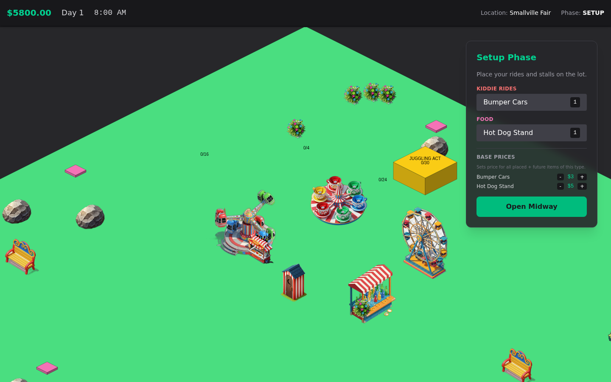
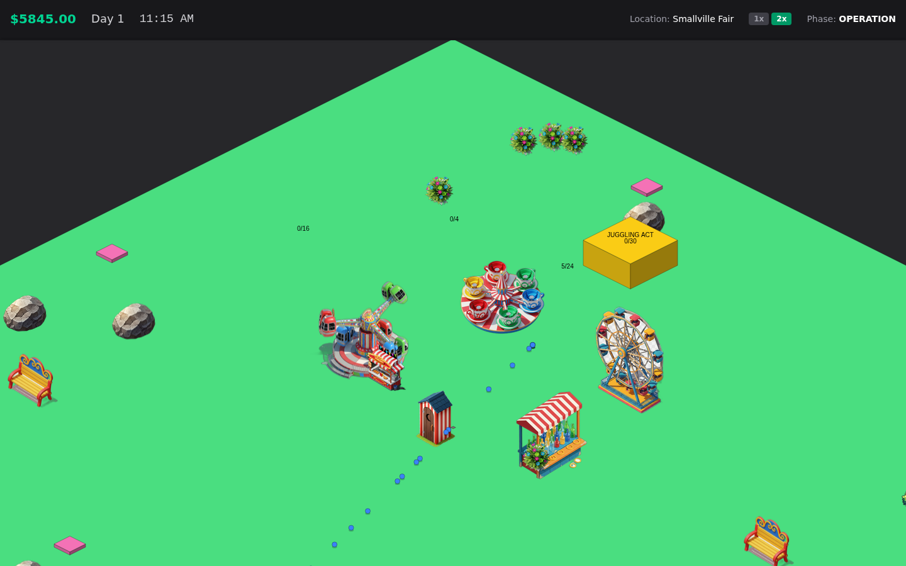

# Midway to Madness — Game Improvement Plan

*Drafted 2 September 2026 against `main` at b96afa5. Companion to `asset-engine-roadmap.md`, which covers the art pipeline; this document covers the game itself.*

## 1. Where the game stands

**What exists.** A traveling-carnival management sim. Each day the player picks a fair (three locations), negotiates a contract (privilege fee plus a city revenue share), places rides and stalls on an isometric lot, runs an 8 AM–10 PM day of guests, tears down, reads a summary, and repeats. Guests carry money, hunger, bladder and excitement and score every attraction by need, price, distance and queue length. Rides have capacity, queues and quality-based breakdowns; maintenance and sanitation staff fix and clean. Around that core: a data-driven item registry (13 built-in items in 8 categories with day and location unlocks, plus 2 more registered from the manifest), biome scenery, an in-browser asset editor (Gemini Imagen → rembg → sharp → manifest), and a sprite registry with primitive-block fallbacks. About 4,700 lines of TypeScript.

**What is good and worth protecting.**

- The guest AI has the right shape: utility scoring with urgency-weighted distance, price sensitivity via `priceRatio`, wait tolerance, and queues. Most of this plan builds on it instead of replacing it.
- Items are data (`ITEM_DEFINITIONS` plus the manifest), so content grows without engine changes.
- The fixed-step 20 Hz simulation is separate from rendering, which makes headless testing and balancing feasible.
- The asset editor is a force multiplier. Every piece of new art in this plan goes through it.

**What is missing, in one sentence.** It is a simulation but not yet a game: nothing pushes back (no running costs, no way to lose, no goal), the player cannot see most of what the sim does (sprites are misaligned, the canvas overflows the screen, guests are dots), and several bugs quietly stall progression after day 1.

## 2. What "better" means

1. **Legible.** The player can see where things are, why guests do what they do, and how the day went.
2. **Tense.** Every day has a decision with a downside: where to go, what to buy, what to charge, whom to hire.
3. **Progressing.** Days add up to something: reputation, a bigger fleet, a season goal, a loss state.
4. **Stable.** Type-checks, tests for the sim, a CI gate, no day-2 surprises.

The phases below are ordered so each one is visible to a player before the next starts.

## 3. Phase 0 — Fix what is broken (about a week)

**Status: shipped.** All 18 are fixed on `claude/game-improvement-plan-poeubk`, verified by a
headless three-day playthrough of the production build (24 checks: the clock advances on days 2
and 3, a location-gated unlock appears on day 3, overlapping placement is refused, the day reaches
closing on its own, and the summary shows a real net).

Ordered by player impact. Each row is a one-PR fix; the first three could ship together.

| # | Impact | Symptom | Cause | Fix |
|---|--------|---------|-------|-----|
| 1 | High | HUD clock and cash stop updating from day 2 onward | `TimeSystem` compares `state.time` with a module-level `lastNotifyTime` that never resets. On day 2 the clock restarts at 8 while the marker sits near 22, so no notify fires until teardown. | Reset the marker in `resetDay()` or keep it in state. |
| 2 | High | Roller Coaster and Pizza Oven can never unlock | `isItemUnlocked` checks `visitedLocations`, but nothing ever appends to it. | Push the location id when a contract is signed. |
| 3 | Medium | `npm run lint` fails with 15 errors | `systems.ts` re-declares Position, Velocity, Renderable, Guest, Staff and Trash (diverging from `ecs.ts`; its Renderable lacks `staff` and `trash`) and calls `world.addComponent<Position>(…)` with a type where a registry key is expected. | Delete the duplicates, import from `ecs.ts`, drop the explicit generic. |
| 4 | High | "2x" speed halves what guests get done | Only the clock and spawn rate use `SIM_SPEED_MULTIPLIERS`. Needs, ride and eat timers, staff work timers and `MovementSystem` use raw wall-clock dt. At 2x a day lasts 84 real seconds but guests still walk 60 units/s and ride for 5–12 real seconds. Spawning is also capped at one guest per tick, so the State Expo cannot reach 3,000 guests at 2x. | Scale dt once in `GameEngine.update`, remove the per-system multipliers, allow several spawns per tick. This also unblocks a real 4x. |
| 5 | Medium | Rides fall into a break-repair loop late in the day | Breakdown chance grows with `patronsServed − quality`; repair resets `condition` but not `patronsServed`. | Reset wear on repair (fully or partially). |
| 6 | High | Guests stop riding after about two rides | Excitement only rises, and ride scores use `(100 − excitement)`. Past 100 every ride scores negative and the guest wanders until closing. | Decay excitement over time, or score on a recovering "fun deficit". |
| 7 | High | Guests never leave before 10 PM | The only transition to `leaving` is `time >= 22`. With #6, bored and broke guests pile up all day (up to 3,000 at the State Expo). | Leave when broke, satisfied, or after a stay length. This is also the main performance lever. |
| 8 | Medium | Soft-lock when cash drops below $500 | The map screen disables every contract and there is no other income; the failure message is an `alert()`. | Game-over or loan path (Phase 2); replace `alert` with in-game UI. |
| 9 | Medium | Items can be placed on each other and off the lot | `placeItem` checks inventory only. | Footprint overlap and bounds check; red ghost when invalid. |
| 10 | Medium | Summary shows revenue only | `stats.expensesToday` has no writers, so profit is invisible. | Wire fee, travel, wages and restock into it (Phase 2 ledger). |
| 11 | High | The Gemini key is compiled into the browser bundle | `vite.config.ts` defines `process.env.GEMINI_API_KEY` into the client, and compose passes the key to the frontend container, but nothing in `src/` reads it. | Remove the define and the env pass-through. |
| 12 | Low | SQLite journal files are committed | `assets.db-wal` and `assets.db-shm` are in git. | Gitignore them; decide deliberately whether `assets.db` is source or build output. |
| 13 | Low | Guest portraits cannot reach the game | The editor offers a "Guest Portrait" category, but the DB `CHECK` on `category` rejects it, and the registry looks for entity type `guest_portrait`. | Add the category to the constraint (or map it to `guest`) and set the entity type. |
| 14 | Medium | Dev mode can run two game loops | `GameEngine.start()` checks `isRunning` before `await spriteRegistry.load()`, so React StrictMode's mount-unmount-mount starts two loops and the sim runs at double speed in `npm run dev`. | Set a `starting` flag before the await, or make `stop()` cancel a pending start. |
| 15 | Low | Stale grid constants | `TILE_WIDTH`/`TILE_HEIGHT` (40/20) are unused by the engine, and the editor's alignment grid uses the same values. A footprint cell is 50 logical units, a 100×50 px diamond, so the editor grid is drawn at the wrong scale. | One `CELL = 50` constant, used by both. |
| 16 | Low | Stale identity | `index.html` title is "My Google AI Studio App", the package is `react-example`, the README is AI Studio boilerplate, the HUD shows raw phase enums. | Rename, write a real README (game, editor, compose), friendly phase labels. |
| 17 | Low | Editor writes files from unsanitized request fields | `generate.ts` joins `category` and `assetId` straight into paths. | Slug-whitelist both. |
| 18 | High | A production build renders a blank page under `vite preview` | The `/assets` dev proxy (meant to reach the sprite server) is inherited by preview and captures Vite's own bundle directory, `dist/assets/`, so the app's JS and CSS return 500. Any host that honors `server.proxy` sees the same. | Set `build.assetsDir` to something like `static`, or move sprites out of `/assets`. |

## 3.5 Staff postings (added out of band, shipped)

Requested between Phase 0 and Phase 1, and taken early because it reshapes the
staff model that Phase 2's save/load and wages will serialize — cheaper now than
after.

Staff were two integers (`{ maintenance: 2, sanitation: 1 }`) with no individual
identity, so there was nothing to assign. They are now a roster of named workers,
each with a posting:

- **Free roam** — the old behavior, unchanged.
- **Posted to a ride** (mechanics) — they service only that attraction type,
  wait beside it between breakdowns so repairs start immediately, and raise the
  patrons it serves before breakdown risk ramps (+25% each, capped at two).
- **Zone** (either role) — a circle on the lot, placed by click and sized by
  slider. They only take jobs inside it and drift back when they near the edge,
  which spreads a crew out instead of letting them all chase the same job.

Zones draw on the ground as isometric ellipses; hovering a mechanic outlines the
ride they are posted to. `npm run check:staff` drives the real systems headless
and asserts the behavior.

This lands an early slice of Phase 3's preventive maintenance (§6.5); the rest of
that item — condition draining with use, paid repairs, idle inspection — still
stands.

## 4. Phase 1 — Make it look like a carnival (2–3 weeks)

Visual work that needs no new art comes first; art through the editor follows.

### 4.1 Sprite anchors (the single biggest visual win)

Every manifest anchor is `{0,0}`, so `drawSpriteIso` places each sprite's **top-left** at the iso projection of the item's logical top-left corner, which is the *top vertex* of the footprint diamond. Sprites hang down and to the right of their lot. Guests walk to the lot's bottom edge and depth sorting uses the lot, so people appear to stand in the wrong place relative to the art.

Seen in a build of `main` (day 1 at Smallville Fair, below): the capacity labels, which are drawn at each footprint's center, float 50–100 px up and to the left of their sprites, and guests walk to the footprint's edge rather than to the art.

- Define the anchor as *the sprite pixel that sits on the footprint's ground center*, and draw at `toIso(x + w/2, y + h/2) − anchor`.
- When an anchor is unset, default to bottom-center minus half the base diamond: `{ x: img.width / 2, y: img.height − (w + h) / 4 }` in sprite pixels for a `w × h` logical footprint (a 1×1 lot is a 100×50 px diamond).
- In the editor's `SpriteCanvas`, overlay the *actual* footprint diamond at sprite scale so the anchor tool aligns art to it. Set anchors for the 19 exported sprites and re-export.

### 4.2 Sprite scale versus footprint

Generated sprite sizes come from `SPRITE_SIZE_MAP` (1×1 → 100 px, 2×2 → 150 px, 3×3 → 200 px), but the footprint diamonds are 100, 200 and 300 px wide. A 3×3 Ferris Wheel covers two-thirds of its lot, so queues form on empty grass. Derive the size from the footprint for new generations (`width = (w + h) × 50`, height = half the width plus headroom for tall rides), and scale existing art at draw time to the footprint width so current sprites work today. In the same build the 3×3 Ferris Wheel renders visibly smaller than the 2×2 Teacups.

### 4.3 Camera and canvas

The canvas is a fixed 1600×1200 element with no CSS sizing, so it overflows most viewports. The initial camera (0, 0, zoom 1) puts the entrance on the bottom edge and cuts off the lot's left, right and bottom corners. Size the canvas to its container (ResizeObserver plus devicePixelRatio), start centered on the entrance at a zoom that fits the lot, add drag-to-pan and WASD, clamp panning to the lot, and add a minimap. In a 1440×900 window the canvas element starts at (−82, −120) and the entrance is below the fold.

### 4.4 People

Guests and staff are 4 px circles. Use the editor's `guest` and `staff` categories: four to six guest outfits with two facings (mirror for the other two), two staff uniforms, a three-frame walk. Portraits follow once bug #13 is fixed; the inspector already renders `guestPortraits`.

### 4.5 Visible queues and states

Draw queued guests as a line from the ride entrance (the `queue` array already carries order). Show a wrench on broken rides and a "sold out" sign on empty stalls. Give rides `base_active` and `broken_state` frames; the renderer already looks for `broken_state`.

### 4.6 Ground, paths, entrance, light

Replace the single flat ground block with tiles (the unreferenced `terrain/grass.png` and `grass2.png` are a start), a worn path from the entrance, and an entrance gate sprite. Add time-of-day lighting: a warm tint from 6 PM sliding to blue by 10 PM, lamp posts glowing. Cheap, and very carnival.

### 4.7 Labels and hygiene

Move labels into a screen-space layer with background pills, shown on hover, selection, or above 1.2x zoom. 23 PNGs in `public/assets/sprites` are not referenced by the manifest: bind or delete them.
Among built-in items only the Juggling Act lacks a sprite, but 7 of 12 scenery types (palm tree, cactus, lamp post, flower patch, trash can, sand dune, fire hydrant) still draw as colored blocks, so lots mix painterly art with flat shapes.

## 5. Phase 2 — Make it a game (3–4 weeks)

This is where stakes come from. Today money only goes up, and nothing forces a choice.

### 5.1 A real ledger

Add daily costs: staff wages (today staff cost only a one-time hire fee), restock for food and shops (stock is refilled free at every placement), ride operating and repair costs (broken rides come back fixed for free overnight). Show a per-day ledger in the summary: gross, city share, fee, travel, wages, restock, repairs, **net**. Add per-item lines: customers, revenue, breakdowns, minutes sold out.

### 5.2 Guest happiness and leaving

Add `happiness` to `Guest`: up on met needs and rides, down on long waits, sold-out stalls, broken rides seen, trash nearby, and prices above value. Guests leave when happiness or money runs out or after a three-to-five hour stay. Happy guests spend more on souvenirs. The day's mean happiness feeds reputation.

### 5.3 Reputation

A persistent 0–100 score that scales `expectedGuests` at the gate (about ±30%) and gates the big contracts. This is the progression spine: a good day matters tomorrow.

### 5.4 Bidding that can be lost

The revenue-share slider says it affects "future bids (simulated)", but nothing is simulated. Give each location a hidden rival bid; fee and share both raise the win chance; a lost bid means taking a smaller fair, or a rest day with wages still due. Add a route map: locations have positions, you can only jump to nearby ones, and distance costs a travel day on top of the existing per-mile fleet cost. Add desert and coastal fairs, since both biomes exist and neither has a location.

### 5.5 A season, and losing

A 20-day season: reach the State Expo (requires reputation and a fleet-value threshold) and finish with a score of cash plus fleet value plus reputation. Bankruptcy when net worth is negative and no contract is affordable: a game-over screen with the season's stats and a restart. This also resolves bug #8.

### 5.6 Save, load, and a front door

Serialize `StateManager.state` (plus day and reputation) to localStorage at every summary. Add a title screen with New Game and Continue, and a settings panel with the music volume slider (`musicManager.setVolume` exists with no UI).

### 5.7 Price feedback

Surface the sim's price sensitivity: "Guests find this: Cheap / Fair / Pricey" in the inspector, and a "walked away over price" counter per item.

## 6. Phase 3 — Deepen the simulation (4–6 weeks)

1. **Walkable grid and pathfinding.** Guests walk in straight lines through rides. Build a 50-unit grid with footprints and scenery as blockers, A* or a flow field per target, and an entrance tile per item. This is the prerequisite for layout mattering.
2. **Player-placed paths.** Cheap path tiles that guests prefer. The shape of the midway becomes the core creative act.
3. **Grid snapping** at 50 units so overlap checks and sprite alignment are exact.
4. **Ride cycles.** Load, run, unload using the `duration` and `timer` fields already on `PlacedItem`; batch capacity; the `base_active` frame plays while running.
5. **Wear and preventive maintenance.** `condition` is binary today. Drain it with use and weather; let idle mechanics inspect rides to slow it; charge for repairs.
6. **Guest archetypes.** Families (kiddie rides, bathrooms), teens (major and spectacular rides, games), seniors (performances, food). The mix depends on the location type. `prestige`, which the sim never reads today, becomes an archetype draw weight and a gate multiplier.
7. **Weather and events.** Rain cuts attendance and lifts food sales; a 9 PM fireworks slot boosts spending; random events (an inspector, a generator failure) that demand a decision.
8. **Cleanliness that matters.** Trash density lowers nearby happiness; trash cans (already a scenery definition) absorb it.
9. **Performance budget: 1,500 guests at 60 fps.** Replace `placedItems.find` per guest per tick with a map by id, cache `getEntitiesWith` results per tick, add a spatial hash for nearby trash and items, and draw guests in batches.

## 7. Phase 4 — Content and polish (ongoing)

- **Sound.** The playlist is empty. Add three to five tracks and a volume control, then effects: ticket ding, ride whir, a clunk on breakdown, a crowd bed scaled to guest count.
- **Onboarding.** A first-day guide (three tooltips: place, price, open) and stat tooltips such as "Quality: patrons served before breakdown risk rises".
- **More content through the editor.** Two more items per category over time (Drop Tower, Log Flume, Fun House, Cotton Candy). The 23 orphaned sprites are candidates. Ride animation frames as in the asset roadmap.
- **Accessibility.** Keyboard for menus, `prefers-reduced-motion`, status colors that do not rely on hue alone.

## 8. Engineering foundation (in parallel, small slices)

- **Type-check and lint gate.** Fix the 15 errors, add ESLint and Prettier, run `tsc --noEmit` in CI.
- **Tests for the sim.** Extract pure functions (attraction scoring, breakdown probability, spawn curve, placement validation, day clock) and cover them with Vitest. Add a headless "simulate N days" script: the sim already runs without a canvas, so a Node harness can print revenue distributions per layout for balancing. The one coupling to remove is `GuestSpawningSystem` reading `spriteRegistry.guestPortraits`.
- **Deterministic RNG.** A seeded generator (scenery already has one) injected into systems, so bugs reproduce and balance tests are stable.
- **State discipline.** `StateManager.update` replaces the state object while systems mutate the previous one in place. It works because everything re-reads `gameStateManager.state`, but it is a trap. Keep in-place mutation for hot paths, route `money`, `time` and `stats` writes through methods, and index `placedItems` by id.
- **CI.** GitHub Actions on pull requests: install, lint, typecheck, test, `vite build`. The project already ships everything through PRs, so this pays off immediately.
- **Debug overlay.** An F3 panel: fps, entity count, guests by state, mean happiness, spawn rate. Needed to balance Phase 2.

## 9. Route card — the first six PRs

Each is small, reviewable, and leaves the game visibly better than before.

| Jump | PR | What the player sees |
|------|----|----------------------|
| 1 ✅ | Foundation: fix tsc, dedupe ECS types, reset `lastNotifyTime`, record `visitedLocations`, fix the StrictMode double start, gitignore journals, remove the key define | Day 2 works, unlocks work, lint is green |
| 2 | Sprite anchors, footprint-scaled drawing, editor grid at true scale | Rides sit on their lots; guests stand where the art is |
| 3 | Canvas fits the viewport, drag-pan, initial framing, placement validation | The lot is on screen; no overlapping rides |
| 4 | One sim clock (dt scaled once), excitement decay, guests leave when done | 2x is real; parks stop filling with bored guests; steady fps |
| 5 | Ledger with wages, restock and repairs; per-item summary; save and load | Profit is visible; a day can lose money; progress survives a refresh |
| 6 | Reputation, rival bids, route map, season goal, game over | The game can be won and lost |

## 10. How we will know it worked

- A new player places, prices and opens a midway without help within two minutes.
- A day at 1x takes about three minutes; at 4x, under a minute.
- Layout matters: two reasonable layouts of the same fleet differ by at least 30% in net.
- Every day has at least one choice with a downside.
- 60 fps with 1,500 guests; lint and tests green on every PR.

## 11. Decisions only the owner can make

1. **Cozy or tense?** RollerCoaster-Tycoon-style park building, or the "madness" of route logistics and risk. This shifts Phase 2's emphasis between 5.1–5.2 and 5.4–5.5.
2. **Session shape.** A 20-day season finished in an hour, or an open-ended save?
3. **Art direction.** Keep the painterly AI sprites, or post-process to a pixel or limited-palette look so mixed generations read as one set? The asset roadmap flagged style drift.
4. **Is the editor player-facing?** If modding is a goal, the manifest becomes a public contract and needs versioning.
